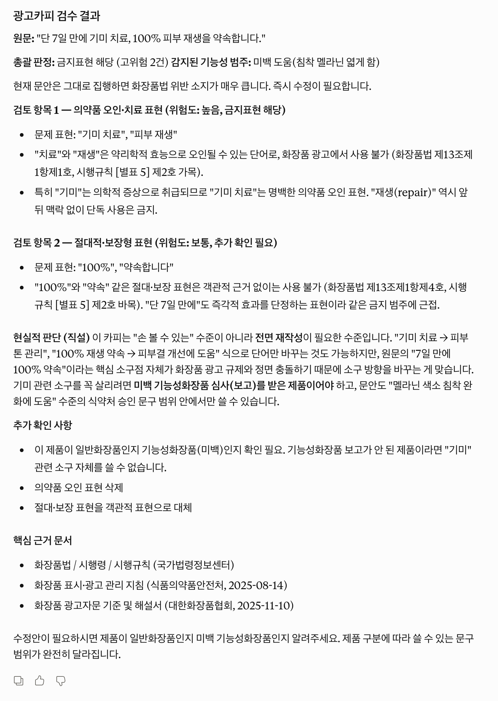

# cosmetics-ad-compliance-mcp

**한국 화장품 광고 카피 검수 엔진 MCP**

> 화장품 광고 문구를 **화장품법 / 시행령 / 시행규칙 / 식약처 지침 / 대한화장품협회 해설서** 기준으로 검토하고,
> 최종 판정 · 검토 항목 · 법령 근거를 구조화해 반환합니다.

[](./LICENSE)
[](https://modelcontextprotocol.io)

---

## MCP 사용법

### 필요한 것

- MCP를 지원하는 AI 클라이언트 하나면 됩니다. (Claude, Cursor, Windsurf, Zed 등)
- 별도 설치, API 키, 코드 실행 없음


### 1단계: MCP 클라이언트에 연결하기

- MCP endpoint: `https://cosmetics-ad-compliance-mcp.igerapex.workers.dev/mcp`

- HTTP(remote) 방식의 MCP 서버입니다. 아래 클라이언트에 endpoint를 그대로 붙여넣으면 됩니다.

#### (1) claude.ai 웹

1. [claude.ai/settings/connectors](https://claude.ai/settings/connectors) 로 이동
2. **커스텀 커넥터 추가** 클릭
3. 이름 입력 (예: `화장품 광고 검수`)
4. **원격 MCP 서버 URL**에 위 endpoint 입력
5. 저장

#### (2) Claude Desktop 앱

1. **설정(Customize) → 커넥터(Connectors)** 이동
2. **커스텀 커넥터 추가** 클릭
3. 이름 입력 (예: `화장품 광고 검수`)
4. **원격 MCP 서버 URL**에 위 endpoint 입력
5. 저장

#### (3) Claude Code (CLI)

```bash
claude mcp add cosmetics-ad-compliance --transport http https://cosmetics-ad-compliance-mcp.igerapex.workers.dev/mcp
```

#### (4) Cursor / Windsurf / Zed 등

각 클라이언트의 MCP 설정 파일에 아래처럼 추가합니다.

```json
{
  "mcpServers": {
    "cosmetics-ad-compliance": {
      "url": "https://cosmetics-ad-compliance-mcp.igerapex.workers.dev/mcp"
    }
  }
}
```

연결 확인: 도구 목록에 `review_ad_copy`, `list_applicable_references`, `explain_finding`이 보이면 정상입니다.

---

### 2단계: 광고 카피 입력

* 연결 후 AI에게 아래 문구를 그대로 붙여넣어 보세요.
* 검수 요청 문구는 자유롭게 작성하셔도 됩니다.

**예시 1 — 의약품 오인 표현**

```
이 화장품 광고 문구 검수해줘:
"단 7일 만에 기미 치료, 100% 피부 재생을 약속합니다."
```

**예시 2 — 전문가 추천 표현**

```
이 화장품 광고 문구 검수해줘:
"피부과 전문의 추천으로 완성된 공식 인증 더마 세럼으로 민감한 피부도 자신 있게 케어하세요."
```

**예시 3 — 원료 효능의 제품 효능 전이 (기능성화장품)**

```
이 화장품 광고 문구 검수해줘 (탈모증상완화 기능성화장품):
"비오틴은 모발 성장에 필수적인 영양소입니다. 탈모 증상 완화에 도움을 주는 기능성화장품."
```

**예시 4 — 허용 표현 확인**

```
이 화장품 광고 문구 검수해줘 (주름개선 기능성화장품):
"매일의 탄력 루틴을 더 탄탄하게. 주름개선 기능성화장품으로 피부를 탄탄하게 가꾸는 데 도움을 줍니다."
```

---

### 엔진 리포트

- `review_ad_copy` tool이 반환하는 `표시용검수보고서` 필드의 실제 출력입니다.
- LLM에게 전달 하는 출력이기 때문에 사용자에게는 노출되지 않습니다.

```
광고카피 검수 결과

원문: "단 7일 만에 기미 치료, 100% 피부 재생을 약속합니다."

총괄 판정: 금지표현 해당
감지된 기능성 범주: 미백 도움(침착 멜라닌 엷게 함)

입력 보완 안내
- 상태: 추가 기입 필요
- 이유: 일반화장품으로 입력되었지만 문안에서 기능성화장품 범주 표현이 감지되었습니다.

검토 항목 1 — 의약품 오인 또는 치료 표현
- 상태: 금지표현 해당 / 위험도: 높음
- 근거 표현: 치료, 재생
- 법령 근거: 화장품법 제13조제1항제1호, 시행규칙 [별표 5] 제2호 가목
- 지침·해설 근거: 화장품 표시·광고 관리 지침 (p.9-11), 화장품 광고자문 기준 및 해설서 (p.11)

검토 항목 2 — 절대적 또는 보장형 표현
- 상태: 추가 확인 필요 / 위험도: 보통
- 근거 표현: 100%
- 법령 근거: 화장품법 제13조제1항제4호, 시행규칙 [별표 5] 제2호 바목
- 지침·해설 근거: 화장품 광고자문 기준 및 해설서 ∙ 절대적 표현 (p.28)

추가 확인 사항
- 의약품 오인 표현 삭제 여부 확인
- 절대 표현을 객관적 표현으로 대체했는지 확인
- 일반화장품인지 기능성화장품인지 cross-check 필요

핵심 근거 문서
- 화장품법 (국가법령정보센터, 기준일 2026-04-02)
- 화장품법 시행령 (국가법령정보센터, 기준일 2026-03-10)
- 화장품법 시행규칙 (국가법령정보센터, 기준일 2025-08-01)
- 화장품 표시·광고 관리 지침 (식품의약품안전처, 기준일 2025-08-14)
- 화장품 광고자문 기준 및 해설서 (대한화장품협회, 기준일 2025-11-10)
```

---

### 사용자가 보는 화면 (Claude Desktop 예시)

* 엔진 리포트를 받은 host LLM이 해석해서 제공합니다.
* LLM 종류·버전에 따라 표현이 달라질 수 있습니다.



---

## 도구 설명

| 도구                         | 용도                              |
| ---------------------------- | --------------------------------- |
| `review_ad_copy`             | 메인 검수. 전체 판정 + 근거 반환  |
| `list_applicable_references` | 검수에 연결된 근거 문서 목록 확인 |
| `explain_finding`            | 특정 검토 항목을 더 자세히 설명   |

`review_ad_copy`로 먼저 전체를 확인하고, 특정 항목이 궁금하면 `explain_finding`으로 이어서 물어보는 흐름이 자연스럽습니다.

---

## 검수 범위

- **제품 구분**: 일반화장품 / 기능성화장품
- **기능성 범주**: 시행규칙 기준 11개 범주 cross-check
- **대표 쟁점**:
  - 의약품 오인 또는 치료 표현, 시술 유사 사용방법 또는 도구 표현
  - 기능성 범위 초과 또는 입증 필요 표현, 신고 범위와 다른 기능성 범주 표현
  - 원료 효능의 제품 효능 전이, 수치·시험 근거 제시형 실증 필요 표현
  - 허가·인증·공인 오인 표현, 절대적 또는 보장형 표현
  - 비교·수치 우위 실증 필요 표현, 비교 우위·순위·유일성 표현
  - 후기·전후 비교·사용자 체험형 표현, 전문가 지정·공인·추천 암시 표현
  - 천연·유기농, 비건, ISO 지수, 인체 유래, 무첨가·free, 특허 관련, 일반적 오인 우려 표현

---

## 공식 근거 문서 (5개)

1. 화장품법
2. 화장품법 시행령
3. 화장품법 시행규칙
4. 화장품 표시·광고 관리 지침 (식품의약품안전처)
5. 화장품 광고자문 기준 및 해설서 (대한화장품협회)

원문을 새 규칙집으로 다시 쓰지 않고, 원문을 기준으로 검수 흐름에 직접 연결하는 구조를 유지합니다.

---

## 동작 방식

1. 입력값을 정규화하고, 제품 구분과 기능성 범주를 먼저 정렬합니다.
2. 입력이 비어 있거나 애매하면, 엔진 보고서에서 추가 확인 안내와 분기 검토 형태로 정리합니다.
3. 5개 공식 근거 문서를 기준으로 관련 source pack을 로드합니다.
4. 광고 카피를 `주장 내용(claim)` 단위로 나누고, 각 `주장 내용(claim)`에서 `판단 신호(signal)`를 읽습니다.
5. `판단 신호(signal)` 조합으로 `검토 쟁점(finding)`을 열고, 각 쟁점을 `금지표현 해당` 또는 `추가 확인 필요`로 정리합니다.
6. 쟁점별 판단과 불확실성을 합쳐 전체 결과를 `금지표현 해당 / 추가 확인 필요 / 사람 검토 필요 / 문제 표현 미감지` 4개 최종 상태값 중 하나로 정리합니다.
7. 법령·지침 근거를 연결해 최종 판정, 검토 항목, 근거, 검수 보고서 형태로 반환합니다.

코어 판정은 deterministic하게 유지하고, LLM은 요청 해석과 결과 설명에만 개입합니다.

---

### 폴더 구조

```
.
├─ examples/         # 예시 입력과 평가 케이스
│  ├─ eval/          # dev / holdout / regression 평가셋
│  └─ requests/      # MCP smoke / 예시 입력용 요청 JSON
├─ packages/
│  ├─ core/          # 검수 엔진 코어 로직
│  ├─ mcp/           # MCP tool surface
│  └─ shared-types/  # 공유 타입 정의
├─ policies/         # 정책 문서, 법령 snapshot, citation index
├─ references/       # 5개 공식 근거 문서 정리
├─ workers/          # Cloudflare Workers 기반 remote MCP 서버
└─ scripts/          # build, eval, 유지보수 스크립트
```

---

## 면책 사항

⚠️ **이 도구는 검수 보조 도구이며, 대한화장품협회의 공식 광고 자문·심사를 대체하지 않습니다.**

- 실제 광고 집행 전 **사내 법무·준법 검토 및 필요 시 대한화장품협회 광고 자문**을 받으셔야 합니다.
- 수록된 근거 문서는 작성 시점 기준이며, 이후 법령·지침 개정으로 내용이 달라질 수 있습니다.
- 판정 결과는 5개 공식 근거 문서 안에서 설명 가능한 범위에 한하며, 모든 광고 쟁점을 망라하지 않습니다.
- 본 도구의 검수 결과에 따라 발생한 어떠한 손해에도 책임지지 않습니다.

---
## License

MIT
